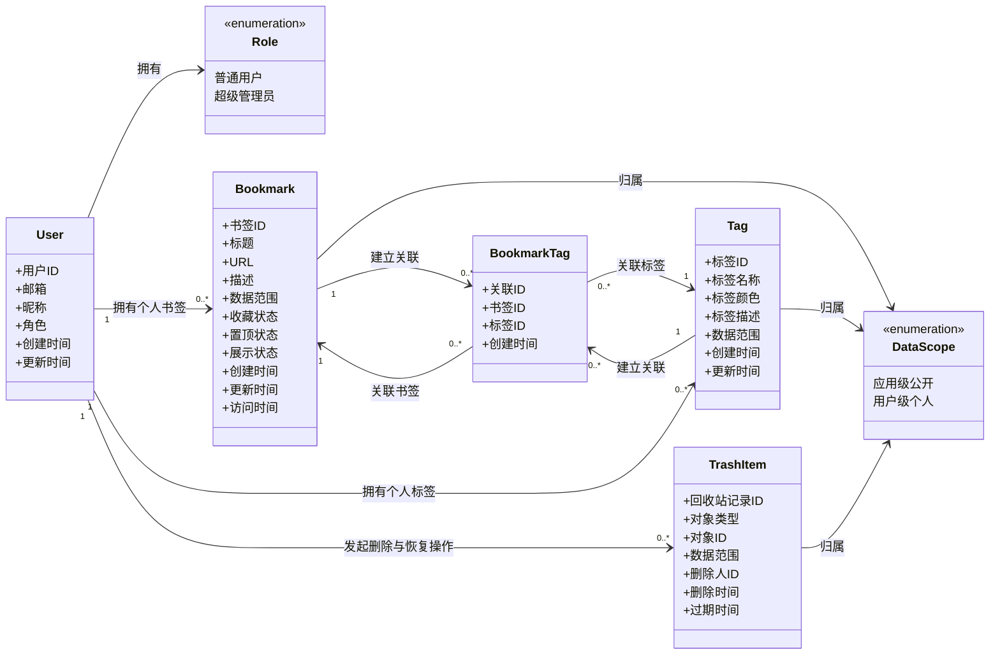

# 书签管理 Web 应用产品需求文档

## 1. 文档信息

| 项目 | 内容 |
|---|---|
| 产品名称 | 书签管理 Web 应用 |
| 文档类型 | 产品需求文档 |
| 文档版本 | v1.0 |
| 目标平台 | Web |
| 目标用户 | 需要高效收藏、整理、检索网页资源的个人用户 |

## 2. 产品概述

### 2.1 产品背景

用户在日常学习、工作和内容浏览过程中，会持续收藏大量网页资源。传统浏览器书签在跨设备整理、标签化管理、快速筛选、批量维护和信息回顾方面存在体验不足。该产品旨在提供一个以“标签”为核心组织方式的书签管理 Web 应用，帮助用户快速保存、分类、查找和管理网页资源。

### 2.2 产品定位

一个轻量、高效、以标签驱动的书签管理工具。产品围绕应用级书签数据和用户级书签数据展开：应用级书签数据面向所有访客展示，用户级书签数据面向已登录用户本人展示和管理。

产品权限采用 RBAC 模型，角色与访问状态逻辑如下：

- RBAC 角色仅包含普通用户和超级管理员两类。
- 未登录访客属于访问状态，不属于 RBAC 角色；可访问应用级书签页，浏览、搜索、筛选、打开和复制应用级公开书签。
- 普通用户登录后可访问用户级书签页和用户级管理页面，对自己的书签、标签、回收站和设置进行管理。
- 超级管理员拥有普通用户的全部用户级功能，并额外拥有应用级书签数据管理能力，可维护应用级公开书签和应用级公开标签。

产品需要区分展示场景和管理场景：在书签展示场景中，左侧侧边栏展示标签列表，右侧内容区域展示当前标签下关联的书签，帮助用户按主题快速浏览和访问；在管理场景中，左侧展示页面菜单，右侧展示当前管理页面的具体内容，帮助用户完成书签、标签、回收站、设置等集中维护操作。

### 2.3 产品目标

- 支持用户创建、编辑、删除和浏览书签。
- 支持用户创建、编辑、删除和浏览标签。
- 支持书签与标签之间的多对多关联。
- 支持通过标签快速筛选对应书签。
- 提供搜索、排序、批量管理、导入导出等基础能力。
- 提供清晰、稳定、低学习成本的 Web 使用体验。

### 2.4 非目标范围

- 不包含浏览器插件能力。
- 不包含团队协作、多人共享空间和复杂权限体系；权限模型采用 RBAC，仅包含普通用户和超级管理员两类角色（访客仅作为未登录访问状态）。
- 不包含网页全文抓取、AI 摘要、自动分类等高级能力。
- 不包含移动端原生 App。

## 3. 用户画像与使用场景

### 3.1 目标用户

#### 3.1.1 知识管理型用户

- 经常收藏技术文章、课程、论文、工具站点等内容。
- 关注分类清晰、检索高效、长期可维护。

#### 3.1.2 工作效率型用户

- 需要管理大量业务系统、工具平台、参考资料和项目链接。
- 关注快速访问、常用书签置顶、批量整理。

#### 3.1.3 内容消费型用户

- 经常收藏博客、视频、社区帖子、购物链接、资讯页面。
- 关注收藏方便、标签灵活、浏览体验清爽。

### 3.2 核心使用场景

| 场景 | 用户诉求 | 产品能力 |
|---|---|---|
| 保存新网页 | 将重要网页保存到个人书签库 | 新建书签、填写 URL、标题、描述、标签 |
| 按主题查找 | 查看某个主题下的所有书签 | 标签侧边栏、标签筛选 |
| 多维分类 | 同一书签可归属多个分类 | 书签与标签多对多关联 |
| 快速检索 | 在大量书签中快速定位目标 | 关键词搜索、过滤、排序 |
| 整理书签 | 批量移动、删除、修改标签 | 批量选择、批量打标签、批量移除标签 |
| 数据迁移 | 从其他工具迁移或备份数据 | 导入、导出 |

## 4. 核心概念与数据模型

### 4.1 书签

书签是用户收藏的网页资源，是产品中的核心内容对象。

#### 4.1.1 书签字段

| 字段 | 必填 | 说明 |
|---|---|---|
| 标题 | 是 | 书签展示名称，默认可由用户手动输入 |
| URL | 是 | 网页访问地址，必须为有效链接 |
| 描述 | 否 | 用户对该网页的补充说明 |
| 标签 | 否 | 与该书签关联的零个或多个标签 |
| 收藏状态 | 否 | 标记是否为收藏或重要书签 |
| 置顶状态 | 否 | 标记是否在列表中优先展示 |
| 展示状态 | 是 | 标记是否在当前数据范围内展示，默认展示 |
| 创建时间 | 是 | 书签创建时间 |
| 更新时间 | 是 | 书签最后编辑时间 |
| 访问时间 | 否 | 用户最近一次打开该书签的时间 |

### 4.2 标签

标签是用户组织书签的核心分类方式。

#### 4.2.1 标签字段

| 字段 | 必填 | 说明 |
|---|---|---|
| 标签名称 | 是 | 标签展示名称，同一用户下不可重复 |
| 标签颜色 | 否 | 用于区分标签的视觉标识 |
| 标签描述 | 否 | 标签用途说明 |
| 书签数量 | 是 | 当前标签关联的书签数量 |
| 创建时间 | 是 | 标签创建时间 |
| 更新时间 | 是 | 标签最后编辑时间 |

### 4.3 书签与标签关系

书签与标签是 N 对 N 的关系。

- 一个书签可以关联零个或多个标签。
- 一个标签可以关联多个书签。
- 数据模型上允许书签处于无标签状态。
- 删除标签时，不删除该标签下的书签，仅移除书签与标签的关联关系。
- 删除书签时，同时移除该书签与所有标签的关联关系。

### 4.4 数据范围

产品需要同时满足两类核心场景：访客可直接浏览和使用应用级公开书签，已登录用户可拥有并管理自己的个人书签。为此，系统定义应用级数据和用户级数据两种数据范围。划分数据范围的目的仅是区分数据来源与管理权限，不改变书签与标签的功能模型。

#### 4.4.1 范围定义与归属

| 数据范围      | 数据内容                                   | 数据份数                          | 查看权限       | 管理权限   |
| --------- | -------------------------------------- | ----------------------------- | ---------- | ------ |
| 应用级数据     | 应用级书签 + 应用级标签 + 应用级回收站 + 应用级设置         | 全应用仅 1 份；不同超级管理员维护的是同一份应用级数据  | 按数据项区分，见下表 | 超级管理员  |
| 用户级数据（个人） | 用户级个人书签 + 用户级个人标签 + 用户级个人回收站 + 用户级个人设置 | 每个普通用户或超级管理员各 1 份；每份仅归属对应用户本人 | 数据所属用户     | 数据所属用户 |

补充说明：超级管理员也拥有一份自己的用户级个人数据；该个人数据与应用级数据分离。

#### 4.4.2 应用级数据访问边界

| 应用级数据项    | 是否公开访问  | 公开访问角色        | 管理角色  |
| --------- | ------- | ------------- | ----- |
| 应用级书签（展示） | 是       | 访客、普通用户、超级管理员 | 超级管理员 |
| 应用级标签（展示） | 是       | 访客、普通用户、超级管理员 | 超级管理员 |
| 应用回收站     | 否（管理场景） | 不开放           | 超级管理员 |
| 应用设置      | 否（管理场景） | 不开放           | 超级管理员 |

边界说明：应用级数据并非全部公开；仅应用级书签和应用级标签的展示能力可公开访问，应用回收站与应用设置属于管理场景。

#### 4.4.3 一致性原则（能力一致）

- 应用级数据和用户级数据都包含书签与标签两个核心对象。
- 书签与标签在两个数据范围中使用一致的字段结构。
- 书签与标签在两个数据范围中使用一致的多对多关联关系。
- 书签与标签在两个数据范围中支持一致的管理能力（创建、编辑、删除、查看、搜索、筛选、排序、批量操作等）。
- 应用级与用户级的差异只体现在数据来源、可见范围、访问入口和管理权限上，不体现在功能模型上。

#### 4.4.4 隔离原则（数据独立）

- 应用级数据与任意用户级数据完全独立且隔离，互不联动。
- A 用户的个人数据与 B 用户的个人数据完全独立且隔离，互不可见、互不影响。
- 同一个 URL 可以同时存在于应用级数据和任意用户级数据中，不视为冲突。
- 在某一数据范围内的编辑、删除、展示状态调整等变更，只影响当前数据范围，不影响其他数据范围。

#### 4.4.5 公开书签保存到个人库规则

- 普通用户或超级管理员将应用级公开书签保存到个人书签库时，系统必须创建一份新的用户级个人书签副本，不建立引用关系。
- 保存时默认复制公开书签的标题、URL 和描述；收藏状态、置顶状态、访问时间等个人化状态按用户级默认值初始化。
- 保存成功后，该个人书签副本归当前用户所有，仅当前用户可查看和管理。
- 保存后的个人书签副本与原应用级公开书签互不联动：后续任一方编辑、隐藏、删除都不影响另一方。
- 保存公开书签时，支持选择个人标签；应用级公开标签不会自动成为用户级个人标签。
- 如果用户选择沿用公开书签的标签名称，系统应在当前用户个人标签中查找同名标签；存在则复用，不存在则创建同名个人标签后再关联。
- 如果当前用户个人书签库中已存在相同 URL，系统不创建副本，并提示该 URL 已存在且可前往编辑已有书签。


产品需要同时满足两类核心场景：访客可直接浏览和使用应用级公开书签，已登录用户可拥有并管理自己的个人书签。为此，系统定义应用级数据和用户级数据两种数据范围。划分数据范围的目的仅是区分数据来源与管理权限，不改变书签与标签的功能模型。

#### 4.4.1 范围定义与归属

| 数据范围 | 数据内容 | 数据份数 | 查看权限 | 管理权限 |
|---|---|---|---|---|
| 应用级数据（公开） | 应用级公开书签 + 应用级公开标签 | 全应用仅 1 份；不同超级管理员维护的是同一份应用级数据 | 所有访客、普通用户、超级管理员 | 超级管理员 |
| 用户级数据（个人） | 用户级个人书签 + 用户级个人标签 | 每个普通用户或超级管理员各 1 份；每份仅归属对应用户本人 | 数据所属用户 | 数据所属用户 |

补充说明：超级管理员也拥有一份自己的用户级个人数据；该个人数据与应用级数据分离。

#### 4.4.2 一致性原则（能力一致）

- 应用级数据和用户级数据都包含书签与标签两个核心对象。
- 书签与标签在两个数据范围中使用一致的字段结构。
- 书签与标签在两个数据范围中使用一致的多对多关联关系。
- 书签与标签在两个数据范围中支持一致的管理能力（创建、编辑、删除、查看、搜索、筛选、排序、批量操作等）。
- 应用级与用户级的差异只体现在数据来源、可见范围、访问入口和管理权限上，不体现在功能模型上。

#### 4.4.3 隔离原则（数据独立）

- 应用级数据与任意用户级数据完全独立且隔离，互不联动。
- A 用户的个人数据与 B 用户的个人数据完全独立且隔离，互不可见、互不影响。
- 同一个 URL 可以同时存在于应用级数据和任意用户级数据中，不视为冲突。
- 在某一数据范围内的编辑、删除、展示状态调整等变更，只影响当前数据范围，不影响其他数据范围。

#### 4.4.4 公开书签保存到个人库规则

- 普通用户或超级管理员将应用级公开书签保存到个人书签库时，系统必须创建一份新的用户级个人书签副本，不建立引用关系。
- 保存时默认复制公开书签的标题、URL 和描述；收藏状态、置顶状态、访问时间等个人化状态按用户级默认值初始化。
- 保存成功后，该个人书签副本归当前用户所有，仅当前用户可查看和管理。
- 保存后的个人书签副本与原应用级公开书签互不联动：后续任一方编辑、隐藏、删除都不影响另一方。
- 保存公开书签时，支持选择个人标签；应用级公开标签不会自动成为用户级个人标签。
- 如果用户选择沿用公开书签的标签名称，系统应在当前用户个人标签中查找同名标签；存在则复用，不存在则创建同名个人标签后再关联。
- 如果当前用户个人书签库中已存在相同 URL，系统不创建副本，并提示该 URL 已存在且可前往编辑已有书签。

### 4.5 领域模型图



#### 4.5.1 领域模型说明

- 用户是个人书签、个人标签和个人回收站的归属主体；未登录访问状态不产生用户级个人数据。
- 角色采用 RBAC，两类角色为普通用户和超级管理员；超级管理员在普通用户能力基础上额外拥有应用级公开书签和应用级公开标签的管理权限。
- 书签和标签通过数据范围区分应用级数据与用户级个人数据，两类数据字段结构和关联规则保持一致。
- 书签与标签通过书签标签关联对象建立多对多关系，允许书签无标签，也允许标签下关联多个书签。
- 应用级公开书签保存到个人库时，会创建新的用户级个人书签副本，副本与原公开书签之间不建立持续引用关系。
- 回收站记录用于承载被删除对象的恢复和清理流程，按数据范围区分个人回收站与应用回收站。

## 5. 产品信息架构

### 5.1 用户进入与场景流转

本节用于补充用户从不同入口进入系统后，在展示场景与管理场景之间的关键流转路径，确保页面结构、权限规则和跳转行为一致。

#### 5.1.1 统一流转原则

- 用户进入路径按访问状态和角色分为访客路径、普通用户路径、超级管理员路径。
- 展示场景与管理场景均复用同一顶部 Header，场景切换不刷新整体框架。
- 访问受限页面时，未登录用户统一先登录，登录成功后进入用户书签页。
- 超级管理员具备普通用户全部流转能力，并新增应用级管理流转。
- 所有场景切换优先保留上下文（当前标签、搜索词、排序、筛选）以降低操作中断。

#### 5.1.2 访客进入与流转

| 进入入口 | 首屏落点 | 可执行动作 | 下一步流转 |
|---|---|---|---|
| 直接访问站点域名 | 应用公开书签页 | 浏览、搜索、筛选、打开、复制公开书签 | 点击登录/注册后进入账户流程 |
| 外部链接进入公开书签页 | 应用公开书签页（可带查询参数） | 浏览公开内容 | 若访问用户级或管理入口，跳转登录页 |
| 未登录访问受限 URL（用户页/管理页） | 登录页 | 登录或注册 | 登录成功后进入用户书签页 |

访客典型流转：

`访客进入 -> 应用公开书签页 -> 浏览/检索公开书签 -> 登录或注册 -> 进入用户书签页`

#### 5.1.3 普通用户进入与流转

| 进入入口 | 首屏落点 | 可执行动作 | 下一步流转 |
|---|---|---|---|
| 登录成功默认跳转 | 用户书签页 | 浏览个人书签、按标签筛选、搜索、快速操作 | 进入用户书签管理页/设置页/回收站 |
| 从 Header 进入“我的书签” | 用户书签页 | 继续浏览与轻操作 | 根据需要进入管理场景 |
| 从 Header 进入“管理入口” | 用户书签管理页 | 批量编辑、标签维护、导入导出 | 返回用户书签页并保留上下文 |
| 从公开书签执行“保存到个人库” | 留在应用公开书签页并提示结果 | 选择标签并保存；若 URL 已存在则提示并引导编辑已有书签 | 可跳转用户书签页查看结果 |

普通用户典型流转：

`登录 -> 用户书签页(展示场景) -> 用户书签管理页(管理场景) -> 设置/回收站 -> 返回用户书签页`

#### 5.1.4 超级管理员进入与流转

| 进入入口 | 首屏落点 | 可执行动作 | 下一步流转 |
|---|---|---|---|
| 管理员登录默认跳转 | 用户书签页 | 执行普通用户全部能力 | 进入应用书签管理页 |
| 从 Header 进入“应用管理” | 应用书签管理页 | 维护应用级公开书签与标签 | 返回公开书签展示页验证效果 |
| 从公开书签页进入应用管理 | 应用书签管理页 | 新增/编辑/删除公开数据 | 回到公开书签页验证展示状态 |

超级管理员典型流转：

`登录 -> 用户书签页 -> 应用书签管理页 -> 应用公开书签页(验证展示) -> 返回管理页继续维护`

#### 5.1.5 展示场景与管理场景双向流转

| 当前场景 | 触发入口 | 目标场景 | 流转规则 |
|---|---|---|---|
| 应用公开书签页（展示） | Header 管理入口（管理员可见） | 应用书签管理页（管理） | 仅超级管理员可达 |
| 用户书签页（展示） | Header/按钮“进入管理” | 用户书签管理页（管理） | 保留当前标签与搜索上下文 |
| 用户书签管理页（管理） | Header/按钮“返回书签” | 用户书签页（展示） | 恢复最近一次展示条件 |
| 应用书签管理页（管理） | Header/按钮“查看公开页” | 应用公开书签页（展示） | 用于即时验证发布结果 |

#### 5.1.6 异常与边界流转

- 会话失效：用户在任意页面操作时若登录态过期，提示重新登录；登录成功后进入用户书签页。
- 权限不足：普通用户访问应用书签管理页时返回 403 页面或无权限提示页，并提供返回用户书签页入口。
- 资源不存在：访问不存在的书签或标签筛选参数时，进入对应场景空状态并提示用户返回“全部书签”。
- 首次登录空数据：新用户进入用户书签页时展示空状态引导，提供“新建书签”“从公开书签保存”“导入数据”三个主入口。

### 5.2 核心布局

产品整体页面采用稳定的四分区结构，以保证展示场景和管理场景在视觉框架、导航方式和内容承载方式上保持一致。

四分区分别为：上左、上右、下左、下右。其中上方区域整体构成页面 Header，上左展示网站 Logo 或产品名称，上右展示全局功能按钮；下方区域根据场景不同承载不同导航和内容。

#### 5.2.1 布局总原则

- 所有主要业务页面统一采用“上左、上右、下左、下右”的四分区布局。
- 上方区域在展示场景和管理场景中完全一致，作为全局 Header 使用；切换场景时不改变 Header 的区域划分、视觉结构和基础功能入口。
- 上左区域固定展示网站 Logo、产品名称或首页入口。
- 上右区域展示全局功能入口：未登录状态展示登录、注册按钮；登录状态展示用户信息模块（头像入口）；不同角色只影响入口可见性，不改变 Header 布局。
- 下左区域作为当前场景的局部导航区：展示场景中展示聚合视图和标签列表，管理场景中展示管理页面菜单。
- 下右区域作为页面核心内容区：展示场景中展示书签内容，管理场景中展示具体管理页面。
- 用户在下左区域完成导航选择后，下右区域随之切换内容；上方 Header 不随下方内容切换而变化。

#### 5.2.2 通用四分区示意

```text
┌──────────────────────┬──────────────────────────────────────────────┐
│ 上左：Logo / 产品名称 │ 上右：全局功能入口                            │
│                      │ 未登录：登录/注册；登录：头像与用户操作弹层      │
├──────────────────────┼──────────────────────────────────────────────┤
│ 下左：场景导航区       │ 下右：核心内容区                                │
│ 展示场景：聚合视图+标签 │ 展示场景：书签列表 / 书签卡片 / 搜索与筛选结果     │
│ 管理场景：页面菜单     │ 管理场景：书签管理 / 标签管理 / 设置 / 回收站等    │
└──────────────────────┴──────────────────────────────────────────────┘
```

#### 5.2.3 顶部 Header 区域

顶部 Header 区域由上左和上右组成，在展示场景和管理场景中完全一致。

- 上左区域展示产品名称或 Logo，并可作为返回默认展示页的入口。
- 上右区域提供全局操作入口，根据用户登录状态和角色动态展示。
- 访客状态下，上右区域展示登录、注册按钮。
- 已登录状态下，上右区域展示用户信息模块，默认形态为用户头像。
- 用户点击头像后，弹出用户操作弹层；弹层内展示用户基本信息和操作按钮。
- 用户操作弹层固定包含：设置、书签管理、退出登录。
- 超级管理员在用户操作弹层中额外包含“应用书签管理”按钮；普通用户不展示该按钮。
- 顶部 Header 不承载具体页面菜单，避免与下左区域的场景导航职责混淆。

#### 5.2.4 展示场景布局

展示场景用于浏览和访问书签，包括应用公开书签页和用户书签页。该场景中，下左区域展示聚合视图和标签列表，下右区域展示当前选择范围内的书签。

```text
┌──────────────────────┬──────────────────────────────────────────────┐
│ Logo / 书签管理        │ 未登录：登录/注册；登录：头像（用户操作弹层）      │
├──────────────────────┼──────────────────────────────────────────────┤
│ 聚合视图               │ 当前视图：收藏                                  │
│ - 全部书签             │ 搜索框 / 排序 / 筛选                             │
│ - 未分类               │                                                │
│ - 收藏                 │ ┌────────────┐ ┌────────────┐ ┌────────────┐ │
│ - 最近添加             │ │ 书签卡片 A  │ │ 书签卡片 B  │ │ 书签卡片 C  │ │
│ - 最近访问             │ └────────────┘ └────────────┘ └────────────┘ │
│ 标签                   │                                                │
│ - 前端开发             │                                                │
│ - 产品设计             │ 书签标题 / URL / 描述 / 标签 / 打开 / 复制等       │
│ - 效率工具             │                                                │
└──────────────────────┴──────────────────────────────────────────────┘
```

展示场景布局规则：

- 下左区域顶部展示聚合视图，至少包含“全部书签”“未分类”“收藏”等常用入口，可按需要扩展“最近添加”“最近访问”等入口。
- 下左区域在聚合视图下方展示标签列表，标签来源于当前数据范围：应用公开书签页展示公开标签，用户书签页展示个人标签。
- 用户点击聚合视图入口时，下右区域展示对应聚合条件下的书签，例如未分类书签、收藏书签或全部书签。
- 用户点击某个标签时，下右区域展示该标签关联的书签。
- 当前选中的聚合视图或标签需要在下左区域有明确视觉状态。
- 下右区域展示书签卡片或轻量列表，并承载当前范围内的搜索、筛选、排序和空状态。
- 标签创建、编辑、删除、排序等管理操作不作为展示场景的主要交互，优先进入管理场景完成。
- 展示场景的核心目标是快速浏览、筛选、打开和复制书签。

#### 5.2.5 管理场景布局

管理场景拆分为两个独立上下文：个人管理场景和应用管理场景。两者共用统一 Header，但左侧导航与右侧内容区不混用，避免超级管理员在操作时混淆当前数据域。

##### 5.2.5.1 个人管理场景

个人管理场景用于用户维护自己的个人书签、个人标签、回收站、导入导出和设置。

```text
┌──────────────────────┬──────────────────────────────────────────────┐
│ Logo / 书签管理        │ 头像（弹层：设置 / 书签管理 / 退出登录）          │
├──────────────────────┼──────────────────────────────────────────────┤
│ 个人管理菜单           │ 当前页面：个人书签管理                           │
│ - 个人书签管理         │ 高级搜索 / 筛选 / 新建书签 / 批量操作             │
│ - 个人标签管理         │                                                │
│ - 导入导出             │ ┌──────────────────────────────────────────┐ │
│ - 回收站               │ │ 表格：标题 / URL / 标签 / 状态 / 时间 / 操作 │ │
│ - 设置                 │ └──────────────────────────────────────────┘ │
└──────────────────────┴──────────────────────────────────────────────┘
```

- 个人管理场景的左侧仅展示个人数据相关菜单，不展示应用级管理入口。
- 个人管理场景的核心目标是集中维护当前用户自己的书签与标签数据。

##### 5.2.5.2 应用管理场景

应用管理场景仅供超级管理员维护应用级公开书签与应用级公开标签。

```text
┌──────────────────────┬──────────────────────────────────────────────┐
│ Logo / 书签管理        │ 头像（弹层：设置 / 书签管理 / 应用书签管理 / 退出登录）│
├──────────────────────┼──────────────────────────────────────────────┤
│ 应用管理菜单           │ 当前页面：应用书签管理                           │
│ - 应用书签管理         │ 高级搜索 / 筛选 / 新建公开书签 / 批量操作         │
│ - 应用标签管理         │                                                │
│ - 应用展示配置         │ ┌──────────────────────────────────────────┐ │
│ - 应用回收站           │ │ 表格：标题 / URL / 标签 / 展示状态 / 时间 │ │
│                        │ └──────────────────────────────────────────┘ │
└──────────────────────┴──────────────────────────────────────────────┘
```

- 应用管理场景的左侧仅展示应用级管理菜单，不展示个人管理入口。
- 应用管理场景应持续强化“当前操作的是应用数据”的感知，例如在页面标题、菜单命名和内容区提示中明确标注“应用级”。
- 应用管理场景的核心目标是维护面向所有访客可见的公开书签与公开标签。

##### 5.2.5.3 场景切换规则

- 个人管理场景和应用管理场景之间不共享左侧菜单。
- 超级管理员在任一时刻只能处于一个明确的数据域内：个人数据域或应用数据域。
- 从个人管理场景进入应用管理场景时，需要通过明确的入口切换，并在页面标题、面包屑或高亮标识中提示当前为应用级管理。
- 从应用管理场景返回个人管理场景时，也应通过明确的返回入口切换，并恢复到个人数据域。
- 管理场景可以承载新建、编辑、删除、批量处理、导入导出、恢复、设置等复杂操作，但必须先明确数据域，再承载具体操作。

#### 5.2.6 展示场景与管理场景对比

| 区域 | 展示场景 | 管理场景 |
|---|---|---|
| 上左 | Logo、产品名称、首页入口 | 与展示场景完全一致 |
| 上右 | 未登录：登录/注册；登录：头像及用户操作弹层入口 | 与展示场景完全一致 |
| 下左 | 聚合视图 + 标签列表 | 个人管理菜单 / 应用管理菜单（按场景独立） |
| 下右 | 当前聚合视图或标签下的书签内容 | 当前管理页面内容 |
| 主要目标 | 浏览、筛选、打开、复制书签 | 创建、编辑、删除、批量处理、配置 |
| 典型组件 | 书签卡片、轻量列表、搜索筛选条 | 表格、表单、批量操作栏、弹窗 |

#### 5.2.7 应用公开书签内容区域

- 展示应用级公开书签数据，所有访客均可浏览。
- 以卡片视图或轻量列表视图为主，突出标题、URL、描述摘要和关联标签。
- 支持按公开标签切换内容区域。
- 支持快速搜索、基础排序和基础筛选。
- 支持打开链接和复制链接。
- 未登录访客不展示新建、编辑、删除、收藏、置顶等个人化或管理操作。
- 普通用户和超级管理员可从应用公开书签中复制链接，或将公开书签保存为自己的个人书签副本。
- 保存到个人书签库时，支持选择个人标签，并在存在相同 URL 时提示已存在并引导用户编辑已有书签。

#### 5.2.8 用户书签内容区域

- 展示当前用户个人书签数据。
- 展示当前标签对应的个人书签列表。
- 以卡片视图或轻量列表视图为主，突出标题、URL、描述摘要和关联标签。
- 支持快速搜索、基础排序和基础筛选。
- 支持打开链接、复制链接、收藏、置顶等高频轻操作。
- 支持空状态引导。

#### 5.2.9 用户书签管理内容区域

- 展示用于管理个人书签的表格或高密度列表。
- 支持高级搜索、多条件筛选、排序和批量操作。
- 支持批量打标签、批量移除标签、批量删除、批量恢复等管理操作。
- 支持查看书签标签关联状态、创建时间、更新时间、最近访问时间等管理字段。
- 支持从用户书签页跳转到用户书签管理页，并保留当前标签或搜索条件上下文。

#### 5.2.10 应用书签管理内容区域

- 展示用于管理应用级公开书签的表格或高密度列表。
- 仅超级管理员可访问。
- 支持创建、编辑、删除应用公开书签。
- 支持创建、编辑、删除应用公开标签。
- 支持调整应用公开书签与应用公开标签的关联关系。
- 支持搜索、筛选、排序和批量管理应用公开书签。
- 支持控制应用公开书签是否展示在应用公开书签页。

### 5.3 页面结构

| 场景 | 页面 | 访问角色 | 说明 |
|---|---|---|---|
| 账号流程 | 登录页 | 访客 | 用户登录入口，登录成功后进入用户书签页 |
| 账号流程 | 注册页 | 访客 | 用户注册入口，注册成功后可自动登录并进入用户书签页 |
| 应用数据展示 | 应用公开书签页 | 访客、普通用户、超级管理员 | 面向所有访客开放的应用级书签展示页，无需登录即可访问 |
| 应用数据管理 | 应用书签管理页 | 超级管理员 | 超级管理员管理应用级公开书签与公开标签数据的页面 |
| 应用数据管理 | 应用标签管理页 | 超级管理员 | 超级管理员管理应用级公开标签信息（创建、编辑、删除） |
| 应用数据管理 | 应用导入导出页 | 超级管理员 | 超级管理员处理应用级公开书签数据导入、导出 |
| 应用数据管理 | 应用回收站页 | 超级管理员 | 超级管理员查看、恢复、永久删除和清空应用级已删除书签 |
| 应用数据管理 | 应用设置页 | 超级管理员 | 超级管理员管理应用级配置与应用级数据策略等设置 |
| 用户数据展示 | 用户书签页 | 普通用户、超级管理员 | 普通用户的用户书签展示页，侧重用户书签浏览、快速访问、标签筛选和搜索 |
| 用户数据管理 | 用户书签管理页 | 普通用户、超级管理员 | 普通用户的用户书签管理页，侧重集中维护、批量处理、标签关联调整和数据整理 |
| 用户数据管理 | 用户标签管理页 | 普通用户、超级管理员 | 普通用户管理用户标签信息（创建、编辑、删除、关联调整） |
| 用户数据管理 | 用户导入导出页 | 普通用户、超级管理员 | 普通用户处理用户书签数据导入、导出 |
| 用户数据管理 | 用户回收站页 | 普通用户、超级管理员 | 普通用户查看、恢复、永久删除和清空用户已删除书签 |
| 用户数据管理 | 用户设置页 | 普通用户、超级管理员 | 普通用户管理用户账户、偏好和用户数据相关设置（如导出策略、隐私偏好等） |

## 6. 功能需求

## 6.1 用户账户

### 6.1.1 注册

#### 功能说明

用户可以创建个人账户，以便保存和管理自己的书签数据。

#### 需求规则

- 支持通过邮箱和密码注册。
- 注册时需要校验邮箱格式。
- 注册时需要校验密码复杂度。
- 邮箱已注册时，需要提示用户更换邮箱或直接登录。
- 注册成功后系统自动分配 RBAC 角色为普通用户。
- 注册成功后可自动登录并进入用户书签页。

### 6.1.2 登录

#### 功能说明

用户可以使用已有账户登录系统。

#### 需求规则

- 支持邮箱和密码登录。
- 登录失败时使用统一错误提示，避免明确区分账号不存在、密码错误等原因；详细失败原因仅用于服务端安全日志，不向用户展示。
- 支持记住登录状态。
- 登录成功后进入用户书签页。

### 6.1.3 退出登录

#### 功能说明

用户可以主动退出当前账号。

#### 需求规则

- 用户点击退出登录后，需要清除当前登录状态。
- 退出后返回登录页。

## 6.2 书签管理

### 6.2.1 新建书签

#### 功能说明

用户可以手动添加一个新的书签。

#### 需求规则

- 新建书签入口在顶部区域和内容区域空状态中可见。
- 新建书签时，URL 和标题为必填项。
- URL 必须符合有效链接格式。
- 同一用户在同一数据范围内 URL 必须唯一；重复 URL 不允许创建副本。
- 用户可以为书签选择一个或多个标签。
- 用户可以在新建书签时同步创建新标签。
- 当用户在某个标签视图下新增书签时，默认关联当前标签。
- 新建成功后，书签展示在对应标签的内容区域中。

### 6.2.2 编辑书签

#### 功能说明

用户可以修改已有书签的信息。

#### 需求规则

- 支持修改标题、URL、描述、标签、收藏状态和置顶状态。
- 修改 URL 时需要重新校验链接格式。
- 修改后的 URL 若与同一用户、同一数据范围内已有书签重复，则不允许保存。
- 修改标签时支持新增关联和移除关联。
- 保存成功后，书签列表和标签计数需要同步更新。

### 6.2.3 删除书签

#### 功能说明

用户可以删除不再需要的书签。

#### 需求规则

- 删除前需要二次确认。
- 删除后书签进入对应数据范围回收站（个人回收站或应用回收站）。
- 删除书签后，该书签不再出现在任何标签的书签列表中。
- 标签关联数量需要同步更新。

### 6.2.4 查看书签

#### 功能说明

用户可以在列表中查看书签基本信息，并打开目标网页。

#### 需求规则

- 书签列表至少展示标题、URL、描述摘要、关联标签、创建时间或更新时间。
- 点击书签标题或打开按钮时，在新浏览器标签页打开 URL。
- 打开书签后更新最近访问时间。
- URL 过长时需要进行视觉截断，不影响复制完整链接。
- 不提供独立书签详情页或详情面板，书签完整字段通过列表展开、行内展示或编辑弹窗承载。
- 查看完整描述、全部标签和时间信息时，应优先在管理页表格、卡片展开区或编辑弹窗中完成。

### 6.2.5 复制书签链接

#### 功能说明

用户可以快速复制书签 URL。

#### 需求规则

- 书签卡片或列表项中提供复制入口。
- 复制成功后需要提供明确反馈。
- 复制失败时需要提示用户手动复制。

### 6.2.6 收藏与置顶

#### 功能说明

用户可以将重要书签标记为收藏或置顶。

#### 需求规则

- 支持收藏或取消收藏。
- 支持置顶或取消置顶。
- 置顶书签在同一标签列表中优先展示。
- 收藏书签可通过“收藏”入口集中查看。

## 6.3 标签管理

### 6.3.1 标签列表

#### 功能说明

侧边栏展示用户所有标签，并作为书签筛选入口。

#### 需求规则

- 标签列表展示标签名称和关联书签数量。
- 点击标签后，内容区域展示该标签关联的书签。
- 当前选中标签需要有明确视觉状态。
- 标签数量较多时，支持侧边栏滚动。

### 6.3.2 系统内置入口

#### 功能说明

侧边栏提供常用系统视图，帮助用户快速访问不同状态的书签。

#### 需求规则

系统内置入口包括：

| 入口 | 说明 |
|---|---|
| 全部书签 | 展示当前用户所有未删除书签 |
| 未分类 | 展示当前范围内无标签书签 |
| 收藏 | 展示已收藏书签 |
| 最近添加 | 展示近期创建的书签 |
| 最近访问 | 展示近期打开过的书签 |

### 6.3.3 新建标签

#### 功能说明

用户可以创建新的标签，用于组织书签。

#### 需求规则

- 标签名称必填。
- 标签名称在同一用户下不可重复。
- 标签名称需要限制最大长度。
- 支持设置标签颜色。
- 创建成功后，标签出现在侧边栏标签列表中。

### 6.3.4 编辑标签

#### 功能说明

用户可以修改已有标签信息。

#### 需求规则

- 支持修改标签名称、颜色和描述。
- 修改名称时需要校验重复。
- 修改成功后，所有关联书签上的标签名称同步更新。

### 6.3.5 删除标签

#### 功能说明

用户可以删除不再需要的标签。

#### 需求规则

- 删除前需要二次确认。
- 删除标签不会删除书签。
- 删除后仅移除该标签与书签的关联关系。

### 6.3.6 标签排序

#### 功能说明

用户可以调整标签在侧边栏中的展示顺序。

#### 需求规则

- 支持按名称排序。
- 支持按书签数量排序。
- 支持按创建时间排序。
- 支持用户自定义排序。

## 6.4 书签与标签关联

### 6.4.1 为书签添加标签

#### 功能说明

用户可以为一个书签关联一个或多个标签。

#### 需求规则

- 在新建或编辑书签时可选择标签。
- 标签选择器支持搜索标签。
- 标签选择器支持多选。
- 用户输入不存在的标签名称时，可快速创建并关联。

### 6.4.2 移除书签标签

#### 功能说明

用户可以从书签中移除某个标签关联。

#### 需求规则

- 移除标签关联不删除标签本身。
- 移除后对应标签的书签数量同步减少。

### 6.4.3 从标签视图移除书签

#### 功能说明

用户在某个标签视图中可以将书签从当前标签移除。

#### 需求规则

- 该操作仅解除当前标签与书签的关联。
- 书签仍保留在其他标签视图和全部书签中。

## 6.5 搜索、筛选与排序

### 6.5.1 全局搜索

#### 功能说明

用户可以在所有书签中搜索目标内容。

#### 需求规则

- 支持按标题、URL、描述和标签名称搜索。
- 搜索结果应展示匹配的书签。
- 搜索关键词为空时恢复默认视图。
- 无结果时展示空状态和清空搜索入口。

### 6.5.2 当前标签内搜索

#### 功能说明

用户可以在当前标签范围内搜索书签。

#### 需求规则

- 当前处于某个标签视图时，搜索默认限定在当前标签下。
- 用户可切换为全局搜索。
- 搜索结果需要保留当前标签上下文。

### 6.5.3 筛选

#### 功能说明

用户可以按书签状态筛选列表。

#### 需求规则

支持以下筛选条件：

- 是否收藏。
- 是否置顶。
- 是否未关联标签。
- 创建时间范围。
- 最近访问时间范围。

### 6.5.4 排序

#### 功能说明

用户可以调整书签列表的展示顺序。

#### 需求规则

支持以下排序方式：

- 默认排序。
- 创建时间从新到旧。
- 创建时间从旧到新。
- 更新时间从新到旧。
- 最近访问时间从新到旧。
- 标题 A-Z。
- 标题 Z-A。

## 6.6 批量操作

### 6.6.1 批量选择

#### 功能说明

用户可以选择多个书签并执行统一操作。

#### 需求规则

- 书签列表支持进入批量选择模式。
- 支持单选、多选和全选当前列表。
- 批量选择后展示已选数量。

### 6.6.2 批量打标签

#### 功能说明

用户可以为多个书签同时添加标签。

#### 需求规则

- 支持为选中的书签追加一个或多个标签。
- 已存在的标签关联不重复添加。
- 操作完成后标签计数同步更新。

### 6.6.3 批量移除标签

#### 功能说明

用户可以从多个书签中同时移除指定标签。

#### 需求规则

- 支持从选中书签中移除一个或多个标签。
- 仅移除存在关联的标签。

### 6.6.4 批量删除

#### 功能说明

用户可以批量删除多个书签。

#### 需求规则

- 删除前需要二次确认。
- 删除后书签进入对应数据范围回收站（个人回收站或应用回收站）。
- 删除后当前列表和标签计数同步更新。

## 6.7 回收站（个人与应用）

### 6.7.1 查看回收站

#### 功能说明

普通用户可以查看个人回收站中的已删除书签；超级管理员还可以查看应用回收站中的已删除公开书签。

#### 需求规则

- 回收站展示已删除书签列表。
- 已删除书签不出现在普通标签视图中。
- 回收站中的书签展示删除时间。
- 回收站按数据范围独立：个人回收站与应用回收站数据不混用。

### 6.7.2 恢复书签

#### 功能说明

用户可以恢复误删书签；超级管理员可恢复误删的应用级公开书签。

#### 需求规则

- 支持单个恢复和批量恢复。
- 恢复后书签回到删除前的标签关联状态。

### 6.7.3 永久删除

#### 功能说明

用户可以永久删除回收站中的书签；超级管理员可永久删除应用回收站中的书签。

#### 需求规则

- 永久删除前需要二次确认。
- 永久删除后不可恢复。
- 支持单个永久删除和批量永久删除。

### 6.7.4 清空回收站

#### 功能说明

用户可以清空当前数据范围下的回收站全部书签。

#### 需求规则

- 清空回收站前需要二次确认。
- 清空范围为当前数据范围全量数据（个人回收站全量或应用回收站全量）。
- 清空后不可恢复。

## 6.8 导入与导出

### 6.8.1 导入书签

#### 功能说明

用户可以从外部文件导入书签数据。

#### 需求规则

- 支持导入浏览器书签 HTML 文件。
- 支持导入结构化文件，如 CSV 或 JSON。
- 导入前展示文件解析结果，包括书签数量和标签数量。
- 导入执行采用同步处理，接口直接返回导入结果。
- 导入时如发现重复 URL，不允许覆盖或创建副本，重复项按失败记录。
- 导入完成后展示成功数量、失败数量和失败原因。

### 6.8.2 导出书签

#### 功能说明

用户可以导出自己的书签数据用于备份或迁移。

#### 需求规则

- 支持导出全部书签。
- 支持导出当前标签下的书签。
- 支持导出选中的书签。
- 支持导出为 HTML、CSV 或 JSON。
- 导出执行采用同步处理，接口直接返回导出结果或下载地址。
- 导出内容应包含书签基本信息和标签关联信息。

## 6.9 设置

### 6.9.1 账户设置

#### 功能说明

用户可以管理基础账户信息。

#### 需求规则

- 支持查看当前登录邮箱。
- 支持修改密码。
- 支持注销账户。
- 注销账户前需要明确风险提示和二次确认。

### 6.9.2 偏好设置

#### 功能说明

用户可以调整产品使用偏好。

#### 需求规则

- 支持设置默认书签视图为列表或卡片。
- 支持设置默认排序方式。
- 支持设置侧边栏默认展开或收起。

### 6.9.3 主题设置

#### 功能说明

用户可以调整界面主题。

#### 需求规则

- 支持浅色主题。
- 支持深色主题。
- 支持跟随系统主题。

## 7. 页面需求

## 7.1 登录页

### 页面目标

让已有用户完成登录并进入产品。

### 页面元素

- 产品名称。
- 邮箱输入框。
- 密码输入框。
- 登录按钮。
- 注册入口。
- 错误提示区域。

### 关键交互

- 邮箱或密码为空时，登录按钮不可提交或提交后提示。
- 登录失败时展示错误信息。
- 登录成功后进入用户书签页。

## 7.2 注册页

### 页面目标

让新用户创建账户。

### 页面元素

- 邮箱输入框。
- 密码输入框。
- 确认密码输入框。
- 注册按钮。
- 登录入口。
- 错误提示区域。

### 关键交互

- 邮箱格式错误时提示。
- 两次密码不一致时提示。
- 注册成功后进入用户书签页。

## 7.3 应用公开书签页

### 页面目标

面向所有访客展示应用级公开书签数据，作为产品的公开内容入口。该页面无需登录即可访问，强调浏览、发现、搜索和打开链接。

### 页面元素

- 顶部导航区。
- 应用公开标签侧边栏。
- 内容区展示工具栏。
- 应用公开书签卡片。
- 排序和基础筛选入口。
- 空状态区域。

### 关键交互

- 访客无需登录即可访问页面和打开公开书签链接。
- 点击公开标签后，内容区域展示该标签下的应用公开书签。
- 搜索关键词后更新应用公开书签列表。
- 点击书签标题或打开按钮访问链接。
- 支持复制公开书签链接。
- 未登录访客不展示新建、编辑、删除、收藏、置顶等操作。
- 登录用户可将应用公开书签保存为自己的个人书签副本。
- 保存时默认复制标题、URL 和描述；支持选择个人标签。
- 如果个人书签库中已存在相同 URL，不创建副本并提示用户前往编辑已有书签。
- 超级管理员可从该页面进入应用书签管理页。

## 7.4 应用书签管理页

### 页面目标

承载超级管理员对应用级公开书签数据的集中维护、批量处理、标签关联调整和数据整理。该页面仅超级管理员可访问，强调“管”和“改”。

### 页面元素

- 顶部管理工具栏。
- 高级搜索输入框。
- 多条件筛选区。
- 排序控件。
- 应用公开书签表格或高密度列表。
- 批量选择控件。
- 批量操作栏。
- 新建应用公开书签入口。
- 应用标签管理页入口。
- 应用导入导出页入口。
- 应用回收站页入口。

### 关键交互

- 支持按标题、URL、描述、标签名称进行搜索。
- 支持按标签、收藏状态、置顶状态、是否未分类、创建时间、更新时间、最近访问时间筛选。
- 支持单选、多选和全选当前结果。
- 支持批量添加标签、批量移除标签、批量删除、批量收藏、批量取消收藏。
- 支持在表格中快速编辑标题、描述、标签、收藏状态和置顶状态。
- 支持批量设置展示状态（公开/隐藏）。
- 普通用户和未登录访客访问该页面时，应被拒绝访问或引导到无权限提示页。

## 7.5 应用标签管理页

### 页面目标

承载超级管理员对应用级公开标签的创建、编辑、删除和排序管理。该页面仅超级管理员可访问。

### 页面元素

- 标签列表或表格。
- 标签名称、颜色、描述字段。
- 标签关联书签数量。
- 新建应用公开标签入口。
- 编辑入口。
- 删除入口。
- 排序控件。

### 关键交互

- 仅超级管理员可以进入应用标签管理页。
- 新建标签时校验名称重复。
- 删除标签前展示影响说明（仅解除关联，不删除书签）。
- 标签排序后，应用公开书签页与应用书签管理页的标签展示顺序同步更新。

## 7.6 应用导入导出页

### 页面目标

承载超级管理员对应用级公开书签数据的导入、导出与结果核对。

### 页面元素

- 导入文件选择区。
- 导入模板下载入口。
- 字段映射与预览区。
- 导入执行按钮。
- 导出条件配置区。
- 导出执行按钮。
- 导入导出历史记录区。

### 关键交互

- 支持 CSV/JSON/HTML（浏览器书签）等约定格式导入。
- 导入前展示预检查结果（重复 URL、格式错误、缺失字段）。
- 可选择“跳过重复”或“中止并修正后重试”策略。
- 导出时支持按标签、时间范围、展示状态筛选。
- 导入导出完成后展示结果摘要（成功数、失败数、原因）。

## 7.7 应用回收站页

### 页面目标

让超级管理员恢复、永久删除或清空应用级已删除书签。

### 页面元素

- 已删除书签列表。
- 删除时间。
- 恢复按钮。
- 永久删除按钮。
- 清空回收站按钮。
- 批量选择入口。

### 关键交互

- 恢复后书签从应用回收站移除，并回到原应用数据范围。
- 永久删除前展示强确认提示。
- 清空回收站前展示强确认提示。

## 7.8 应用设置页

### 页面目标

让超级管理员管理应用级配置与应用级数据策略。

### 页面元素

- 应用基础信息区域。
- 应用公开策略配置区。
- 应用数据策略配置区（去重、导出、保留期等）。
- 审计与操作日志入口。
- 保存按钮。

### 关键交互

- 修改配置后需显式保存。
- 关键策略变更需要二次确认。
- 配置生效后应提示影响范围与生效时间。

## 7.9 用户书签页

### 页面目标

承载普通用户的个人书签浏览、主题化展示、快速搜索和快速访问。用户书签页展示的是当前登录用户自己的书签数据，强调“看”和“打开”，减少复杂管理操作对浏览体验的干扰。

### 页面元素

- 顶部导航区。
- 个人标签侧边栏。
- 内容区展示工具栏。
- 个人书签卡片。
- 排序和基础筛选入口。
- 空状态区域。

### 关键交互

- 点击个人标签切换内容区域。
- 搜索关键词后更新当前个人书签展示范围内的书签列表。
- 点击书签标题或打开按钮访问链接。
- 支持复制链接、收藏、置顶等高频轻操作。
- 支持从当前标签、当前搜索结果或全部书签进入用户书签管理页。
- 用户书签页不承担复杂批量管理职责，批量选择、批量打标签、批量删除等操作统一在用户书签管理页完成。

## 7.10 用户书签管理页

### 页面目标

承载普通用户对个人书签数据的集中维护、批量处理、标签关联调整和数据整理。功能与 7.4 应用书签管理页保持一致，差异仅在数据范围（个人）和访问角色（普通用户、超级管理员）。

### 页面元素

- 与 7.4 应用书签管理页保持一致。
- 页面入口与跳转目标替换为用户数据范围（用户标签管理页、用户导入导出页、用户回收站页）。

### 关键交互

- 与 7.4 应用书签管理页保持一致。
- 仅作用于当前登录用户的个人书签数据。

## 7.11 用户标签管理页

### 页面目标

承载普通用户对个人标签的创建、编辑、删除和排序管理。功能与 7.5 应用标签管理页保持一致，差异仅在数据范围（个人）和访问角色（普通用户、超级管理员）。

### 页面元素

- 与 7.5 应用标签管理页保持一致。

### 关键交互

- 与 7.5 应用标签管理页保持一致。
- 所有标签变更仅影响当前登录用户个人标签体系。

## 7.12 用户导入导出页

### 页面目标

承载普通用户对个人书签数据的导入、导出与结果核对。功能与 7.6 应用导入导出页保持一致，差异仅在数据范围（个人）和访问角色（普通用户、超级管理员）。

### 页面元素

- 与 7.6 应用导入导出页保持一致。

### 关键交互

- 与 7.6 应用导入导出页保持一致。
- 导入导出仅作用于当前登录用户个人书签数据。

## 7.13 用户回收站页

### 页面目标

让普通用户恢复、永久删除或清空个人已删除书签。功能与 7.7 应用回收站页保持一致，差异仅在数据范围（个人）和访问角色（普通用户、超级管理员）。

### 页面元素

- 与 7.7 应用回收站页保持一致。

### 关键交互

- 与 7.7 应用回收站页保持一致。
- 回收、删除和清空操作仅作用于当前登录用户个人回收站。

## 7.14 用户设置页

### 页面目标

让普通用户管理账户信息、个性化偏好与个人数据策略。功能与 7.8 应用设置页在配置模式上保持一致，配置对象为当前用户。

### 页面元素

- 账户信息区域。
- 密码修改区域。
- 偏好设置区域。
- 主题设置区域。
- 个人数据策略配置区（导出偏好、隐私偏好等）。
- 保存按钮。
- 注销账户入口。

### 关键交互

- 修改配置后需显式保存。
- 涉及账户安全的操作（如修改密码、注销）需要二次确认。
- 配置保存后提示生效状态。

## 8. 交互与状态需求

### 8.1 空状态

| 场景 | 展示内容 | 引导操作 |
|---|---|---|
| 无书签 | 暂无书签 | 新建书签 |
| 当前标签无书签 | 该标签下暂无书签 | 新建书签或关联已有书签 |
| 搜索无结果 | 未找到匹配书签 | 清空搜索 |
| 仅有未分类入口 | 暂无自定义标签 | 新建标签 |
| 回收站为空 | 回收站为空 | 返回书签管理页 |

### 8.2 加载状态

- 页面初次加载时展示整体加载状态。
- 切换标签时内容区域展示局部加载状态。
- 保存、删除、导入、导出等操作进行中需要展示按钮加载状态。

### 8.3 成功反馈

- 新建成功后提示“书签已创建”。
- 编辑成功后提示“书签已更新”。
- 删除成功后提示“书签已移至回收站”。
- 标签操作成功后提示对应结果。
- 导入导出完成后展示结果摘要。

### 8.4 错误反馈

- 表单校验错误应靠近对应字段展示。
- 网络或服务异常应展示全局错误提示。
- 操作失败时应保留用户已输入内容，避免丢失。

### 8.5 确认提示

以下操作需要二次确认：

- 删除书签。
- 批量删除书签。
- 删除标签。
- 永久删除书签。
- 清空回收站。
- 注销账户。

## 9. 权限与数据边界

### 9.1 权限模型总览（RBAC）

产品权限采用 RBAC模型（基于角色的访问控制），并结合数据范围做最终鉴权。

系统仅定义两类 RBAC 角色：

- 普通用户（`user`）
- 超级管理员（`super_admin`）

补充说明：

- 未登录访客仅是访问状态（guest），不属于 RBAC 角色。
- 鉴权遵循最小权限原则：默认拒绝、显式授权、按角色与数据范围同时判断。

### 9.2 角色分配与变更规则

- 用户注册成功后，系统自动分配 `普通用户` 角色。
- `超级管理员` 角色不得通过前端注册、前端页面或普通业务接口授予。
- `超级管理员` 角色的分配与回收仅允许通过数据库操作完成。
- 数据库中的角色变更在用户下次登录或令牌刷新后生效（具体机制由技术实现决定，但必须保证最终一致）。

### 9.3 数据范围与数据所有权

系统数据分为应用级数据与用户级个人数据两个范围：

| 数据范围    | 数据内容                             | 查看权限        | 管理权限     |
| ------- | -------------------------------- | ----------- | -------- |
| 应用级数据   | 应用级书签、应用级标签、应用级回收站、应用级设置         | 按数据项区分（见下表） | 超级管理员    |
| 用户级个人数据 | 用户级个人书签、用户级个人标签、用户级个人回收站、用户级个人设置 | 数据所属用户本人    | 数据所属用户本人 |

| 应用级数据项    | 公开访问 | 可访问角色         |
| --------- | ---- | ------------- |
| 应用级书签（展示） | 是    | 访客、普通用户、超级管理员 |
| 应用级标签（展示） | 是    | 访客、普通用户、超级管理员 |
| 应用级回收站    | 否    | 超级管理员         |
| 应用级设置     | 否    | 超级管理员         |

边界要求：

- 每个登录用户（普通用户或超级管理员）都拥有且仅拥有一份自己的用户级个人数据。
- 不同用户之间个人数据严格隔离，禁止互访、互查、互改。
- 应用级数据并非全部公开；仅应用级书签和应用级标签展示可公开访问，应用回收站和应用设置均属于管理场景。
- 超级管理员拥有应用级数据管理权限，但不因此获得“访问或修改其他用户个人数据”的权限。

### 9.4 页面与能力访问矩阵

| 页面/能力                      | 访客      | 普通用户         | 超级管理员        |
| -------------------------- | ------- | ------------ | ------------ |
| 应用公开书签浏览（查看、搜索、筛选、打开、复制链接） | 允许      | 允许           | 允许           |
| 用户个人书签与个人标签管理              | 禁止（需登录） | 允许（仅本人）      | 允许（仅本人）      |
| 应用级公开书签与公开标签管理             | 禁止      | 禁止           | 允许           |
| 应用回收站访问                    | 禁止      | 禁止           | 允许           |
| 应用设置访问                     | 禁止      | 禁止           | 允许           |
| 登录、注册                      | 允许      | 已登录时可按产品策略处理 | 已登录时可按产品策略处理 |

### 9.5 未登录访问

- 未登录访客可以访问应用公开书签页。
- 未登录访客可以查看、搜索、筛选、打开和复制应用公开书签。
- 未登录访客访问用户书签页或用户书签管理页时，需要跳转到登录页。
- 未登录访客访问应用管理页（应用书签管理、应用标签管理、应用导入导出、应用回收站、应用设置）时，需要跳转到登录页或无权限提示页。
- 登录页和注册页允许未登录访问。

### 9.6 普通用户访问

- 普通用户登录后可访问应用公开书签页，并可查看、搜索、筛选、打开、复制公开书签。
- 普通用户可访问并管理自己的用户级个人数据（个人书签、个人标签、个人回收站、个人设置），且仅限本人数据范围。
- 普通用户可将应用公开书签保存到个人书签库，保存后形成独立副本。
- 普通用户不得访问应用管理页（应用书签管理、应用标签管理、应用导入导出、应用回收站、应用设置）。
- 普通用户访问应用管理页时，需要返回 403 页面或无权限提示页。

### 9.7 超级管理员访问

- 超级管理员拥有普通用户的全部用户级功能。
- 超级管理员可以访问用户书签页和用户书签管理页，浏览和管理自己的用户级书签与用户级标签。
- 超级管理员比普通用户额外拥有应用书签管理页访问权限。
- 应用书签管理页仅超级管理员可访问。
- 普通用户访问应用书签管理页时，需要展示无权限提示。
- 超级管理员可以创建、编辑、删除应用公开书签和应用公开标签。
- 超级管理员可以访问并管理应用回收站（恢复、永久删除、清空）。
- 超级管理员管理应用公开书签时，不应影响任何用户的个人书签数据，包括超级管理员自己的个人书签数据。
- 系统不提供“在页面内授予超级管理员”的能力，超级管理员资格由数据库侧维护。

### 9.8 鉴权行为与异常处理

- 未登录访问受限页面时（如用户个人页、应用管理页），应跳转登录页。
- 已登录但角色不足时（如普通用户访问应用管理页），应返回 403 或无权限提示页。
- 权限校验必须在后端执行，前端“隐藏入口”仅作为体验优化，不能替代后端鉴权。
- 所有越权请求都应被拒绝，并记录必要的审计日志（如用户 ID、角色、目标资源、时间）。

### 9.9 数据操作边界

- 删除标签不删除书签，仅解除关联关系。
- 删除用户级书签进入用户个人回收站；删除应用级公开书签进入应用级回收站。
- 永久删除仅作用于当前数据范围，不得跨范围影响其他数据。
- 注销账户仅删除当前账户的用户级个人数据，不删除应用级数据；执行前必须强提醒并二次确认。

## 10. 业务规则

### 10.1 书签规则

- URL 是判断重复书签的主要依据。
- 同一数据范围内，书签 URL 必须唯一，不允许保留重复副本。
- 应用级公开书签与用户级个人书签属于不同数据范围，二者 URL 重复不视为冲突。
- 应用级公开书签保存到用户个人书签库后，形成独立的用户级个人书签副本，采用复制而非引用，后续双方编辑、隐藏或删除互不影响。
- 应用级书签和用户级书签的字段、状态、标签关联和管理操作保持一致。
- 书签标题不能为空。
- 书签可以关联零个、一个或多个标签。
- 置顶只在当前列表或当前筛选范围内生效。

### 10.2 标签规则

- 同一用户下个人标签名称不可重复。
- 应用公开标签名称在应用公开数据范围内不可重复。
- 应用级标签和用户级标签的字段、排序、关联关系和管理操作保持一致。
- 标签名称不能为空。
- 标签删除后，关联书签仍然保留。
- 个人标签仅影响用户个人书签。
- 应用公开标签仅影响应用公开书签。
- 系统内置入口不可编辑、删除或重命名。

### 10.3 搜索规则

- 搜索范围包括标题、URL、描述和标签名称。
- 搜索结果需要受当前视图范围影响，除非用户切换为全局搜索。
- 搜索关键词前后空格应自动忽略。

### 10.4 导入规则

- 导入文件格式错误时，需要提示用户重新选择文件。
- 部分导入失败时，不影响成功数据写入。
- 导入完成后需要提供导入结果摘要。

## 11. 非功能需求

### 11.1 易用性

- 核心操作路径应尽量短。
- 新建书签、选择标签、打开书签应作为高频操作重点优化。
- 主要操作按钮文案应清晰直观。

### 11.2 性能体验

- 标签切换应快速响应。
- 书签数量较多时，列表滚动应保持流畅。
- 搜索输入应具备即时反馈或明确的搜索触发机制。

### 11.3 可访问性

- 主要操作应支持键盘访问。
- 表单输入项应有明确标签。
- 颜色不应作为唯一状态表达方式。
- 文字和背景需要保持足够对比度。

### 11.4 兼容性

- 支持主流桌面浏览器。
- 页面在常见笔记本屏幕宽度下应可正常使用。
- 小屏幕下侧边栏应支持收起或抽屉式展示。

### 11.5 安全性

- 密码类信息不得明文展示。
- 登录等账号相关流程应避免通过错误文案、响应状态、响应时间等方式暴露账号是否存在。
- 用户数据需要按账号隔离。
- 删除、注销等高风险操作需要明确确认。
- 打开外部链接时需要避免影响当前应用安全。

## 12. 数据统计需求

### 12.1 用户侧统计展示

可在设置页或首页摘要中展示：

- 总书签数。
- 总标签数。
- 收藏书签数。
- 未分类书签数。
- 最近新增书签数。

### 12.2 产品运营指标

可用于后续产品评估：

- 日活跃用户数。
- 应用公开书签页访问次数。
- 应用公开书签打开次数。
- 应用公开书签保存到个人书签库次数。
- 人均个人书签数量。
- 人均个人标签数量。
- 新建个人书签次数。
- 搜索使用次数。
- 导入导出使用次数。
- 书签打开次数。

## 13. 验收标准

### 13.1 书签功能验收

- 用户可以成功创建包含标题和 URL 的书签。
- 用户可以为同一书签关联多个标签。
- 用户可以编辑书签信息并保存成功。
- 用户可以删除书签，删除后进入对应数据范围回收站。
- 用户可以从回收站恢复书签。
- 用户可以永久删除回收站中的书签。

### 13.2 标签功能验收

- 用户可以创建标签，且重复名称无法创建。
- 标签创建后出现在侧边栏。
- 点击标签后，内容区只展示该标签关联的书签。
- 删除标签后，关联书签不被删除。

### 13.3 关联关系验收

- 一个书签可以同时出现在多个标签视图中。
- 从某个标签中移除书签时，书签仍可出现在其他标签视图中。
- 删除书签后，该书签从所有标签视图中消失。
- 标签书签数量随关联变化正确更新。

### 13.4 搜索与筛选验收

- 用户可以通过标题搜索到书签。
- 用户可以通过 URL 搜索到书签。
- 用户可以通过描述搜索到书签。
- 用户可以通过标签名称搜索到书签。
- 无搜索结果时展示空状态。

### 13.5 页面体验验收

- 未登录访客可以访问应用公开书签页。
- 应用公开书签页包含顶部区域、公开标签侧边栏和面向展示的内容区域。
- 应用公开书签页以浏览、搜索、筛选、打开链接为主要体验。
- 未登录访客不能访问用户书签页和用户书签管理页。
- 未登录访客和普通用户不能访问应用书签管理页。
- 超级管理员可以访问应用书签管理页，并管理应用公开书签和应用公开标签。
- 超级管理员也可以访问用户书签页和用户书签管理页，管理自己的个人书签和个人标签。
- 用户书签页包含顶部区域、个人标签侧边栏和面向展示的内容区域。
- 用户书签页以浏览、搜索、筛选、打开链接为主要体验。
- 用户书签管理页包含高级搜索、筛选、排序、表格或高密度列表和批量操作能力。
- 用户可以从用户书签页进入用户书签管理页，并带入当前标签或搜索上下文。
- 当前选中标签具有明确视觉状态。
- 新建、编辑、删除操作均有成功或失败反馈。
- 高风险操作均有二次确认。

## 14. 后续迭代方向

- 浏览器插件，一键收藏当前网页。
- 网页标题和图标自动识别。
- 网页可用性检测，识别失效链接。
- AI 自动打标签和内容摘要。
- 书签全文搜索。
- 多设备同步体验增强。
- 团队共享书签库。
- 公开收藏夹和分享链接。
- 阅读状态和稍后阅读能力。
- 标签层级或文件夹能力。
