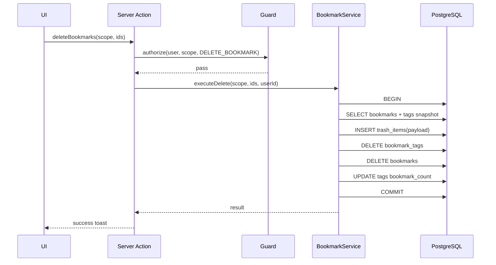

# 书签管理 Web 应用技术方案文档

## 1. 文档信息

| 项目 | 内容 |
|---|---|
| 文档名称 | 书签管理 Web 应用技术方案文档 |
| 版本 | v1.1 |
| 关联 PRD | `E:\projects\bookmark-lite-docs\prd\bookmark-lite-prd.md` |
| 关联技术栈 | `E:\projects\bookmark-lite-docs\tech-stack\bookmark-lite-tech-stack.md` |
| 技术方向 | Next.js 16 App Router 全栈 |
| 输出目录 | `E:\projects\bookmark-lite-docs` |

## 2. 目标与范围

### 2.1 建设目标

1. 落地 PRD 全量功能：账户、书签、标签、搜索筛选排序、批量操作、导入导出、回收站、设置、审计统计。
2. 严格执行双数据域模型：应用级（公开展示 + 管理）与用户级（个人独立）。
3. 保障权限与安全：RBAC + 数据范围鉴权 + 审计留痕。
4. 在指定技术栈内实现：Next.js + React + TypeScript + PostgreSQL + Prisma + Auth.js + Tailwind + shadcn/ui。

### 2.2 非范围（与 PRD 保持一致）

- 不实现浏览器插件。
- 不实现团队协作/共享空间/复杂权限体系。
- 不实现 AI 自动打标、全文抓取、移动原生 App。

## 3. 技术栈落地方案

| 分层 | 选型 | 落地说明 |
|---|---|---|
| 运行时 | Node.js 24.16.x LTS | 本地开发、构建、服务端运行统一版本 |
| Web 框架 | Next.js 16.2.x App Router | `app/` 目录组织页面、Route Handlers、Server Actions |
| 语言 | TypeScript 6.0.x | 全链路类型约束 |
| UI | React 19.2.x + Tailwind 4.3.x + shadcn/ui | 展示页与管理页统一组件体系 |
| 数据库 | PostgreSQL 16.x | 核心业务数据、审计日志、统计事件 |
| ORM | Prisma 7.8.x | Schema、迁移、类型安全访问 |
| 认证 | Auth.js (next-auth 4.24.x) Credentials | 邮箱密码登录、会话管理 |
| 权限 | Middleware + 服务端权限守卫 | 路由入口拦截 + 最终鉴权 |
| 密码安全 | Argon2id 优先（降级 bcrypt） | 安全哈希存储 |
| 文件导入导出 | csv-parse/fast-csv + cheerio + JSON | CSV/JSON/浏览器 HTML 书签 |
| 日志监控 | Pino + Vercel Logs + Analytics | 应用日志与行为统计 |
| 定时任务 | Vercel Cron | 回收站与审计日志保留期清理 |
| 测试 | Playwright + Testing Library/Jest DOM | 端到端与关键 UI 断言 |

## 4. 总体架构设计

### 4.1 架构形态

- **单体全栈应用**：Next.js 同时承载前端页面、服务端动作、接口路由。
- **分层**：
  1. 表现层：App Router 页面、Server Components、Client Components。
  2. 应用层：Server Actions、Route Handlers、用例服务（Service）。
  3. 领域层：书签、标签、回收站、设置、权限策略。
  4. 基础设施层：Prisma、PostgreSQL、Auth.js、日志、缓存、限流、文件解析。

### 4.2 关键设计原则

1. **数据域强隔离**：应用级与用户级通过 `scope + owner_user_id` 强约束，不跨域读写。
2. **后端强鉴权**：前端可隐藏入口，但所有读写在服务端二次校验。
3. **可恢复删除**：删除先入回收站，恢复时尽量还原原标签关系。
4. **同步可感知**：导入导出按 PRD 要求同步执行并返回摘要。
5. **统一模型双场景复用**：应用级与用户级使用同一套书签/标签能力模型，仅权限与数据归属不同。

## 5. 数据结构设计（核心）

## 5.1 枚举定义

```sql
-- 角色
role_enum = ('user', 'super_admin')

-- 数据范围
data_scope_enum = ('APP', 'USER')

-- 回收站对象类型
trash_object_type_enum = ('BOOKMARK')

-- 主题
theme_enum = ('light', 'dark', 'system')
```

### 5.2 核心表结构

#### 5.2.1 用户与认证

1. `users`

| 字段 | 类型 | 约束 | 说明 |
|---|---|---|---|
| id | uuid | PK | 用户 ID |
| email | varchar(320) | UNIQUE NOT NULL | 登录邮箱 |
| password_hash | text | NOT NULL | Argon2id/bcrypt 哈希 |
| role | role_enum | NOT NULL DEFAULT `user` | RBAC 角色 |
| created_at | timestamptz | NOT NULL | 创建时间 |
| updated_at | timestamptz | NOT NULL | 更新时间 |

2. `auth_sessions`（若使用 Auth.js 数据库会话）

| 字段 | 类型 | 约束 |
|---|---|---|
| session_token | text | PK |
| user_id | uuid | FK -> users(id) |
| expires | timestamptz | NOT NULL |

#### 5.2.2 书签与标签

1. `bookmarks`

| 字段 | 类型 | 约束 | 说明 |
|---|---|---|---|
| id | uuid | PK |
| scope | data_scope_enum | NOT NULL | `APP`/`USER` |
| owner_user_id | uuid | nullable FK -> users(id) | USER 范围必填，APP 范围为空 |
| title | varchar(300) | NOT NULL |
| url | text | NOT NULL |
| normalized_url | text | NOT NULL | 规范化后 URL（去尾斜杠、host 小写等） |
| description | text | nullable |
| is_favorite | boolean | NOT NULL DEFAULT false |
| is_pinned | boolean | NOT NULL DEFAULT false |
| is_visible | boolean | NOT NULL DEFAULT true | 应用级公开展示开关 |
| last_visited_at | timestamptz | nullable |
| created_at | timestamptz | NOT NULL |
| updated_at | timestamptz | NOT NULL |

约束：
- `CHECK ((scope='APP' AND owner_user_id IS NULL) OR (scope='USER' AND owner_user_id IS NOT NULL))`

唯一索引：
- `UNIQUE (normalized_url) WHERE scope='APP'`
- `UNIQUE (owner_user_id, normalized_url) WHERE scope='USER'`

2. `tags`

| 字段 | 类型 | 约束 | 说明 |
|---|---|---|---|
| id | uuid | PK |
| scope | data_scope_enum | NOT NULL |
| owner_user_id | uuid | nullable FK -> users(id) |
| name | varchar(80) | NOT NULL |
| color | varchar(20) | nullable |
| description | text | nullable |
| sort_order | int | NOT NULL DEFAULT 0 |
| bookmark_count | int | NOT NULL DEFAULT 0 | 冗余计数，服务层维护 |
| created_at | timestamptz | NOT NULL |
| updated_at | timestamptz | NOT NULL |

约束：
- 同 `bookmarks` 的 scope/owner 约束。

唯一索引：
- `UNIQUE (name) WHERE scope='APP'`
- `UNIQUE (owner_user_id, name) WHERE scope='USER'`

3. `bookmark_tags`

| 字段 | 类型 | 约束 |
|---|---|---|
| bookmark_id | uuid | FK -> bookmarks(id) ON DELETE CASCADE |
| tag_id | uuid | FK -> tags(id) ON DELETE CASCADE |
| created_at | timestamptz | NOT NULL |

唯一键：
- `UNIQUE (bookmark_id, tag_id)`

实现规则：
- 服务层在写入时校验 bookmark/tag 必须处于同一 `scope` 且同一 `owner_user_id`（USER 场景）。

#### 5.2.3 回收站

`trash_items`

| 字段 | 类型 | 约束 | 说明 |
|---|---|---|---|
| id | uuid | PK |
| scope | data_scope_enum | NOT NULL |
| owner_user_id | uuid | nullable FK -> users(id) |
| object_type | trash_object_type_enum | NOT NULL |
| object_id | uuid | NOT NULL | 原对象 ID |
| payload | jsonb | NOT NULL | 快照（书签字段 + 标签 ID 列表） |
| deleted_by_user_id | uuid | FK -> users(id) |
| deleted_at | timestamptz | NOT NULL |
| expires_at | timestamptz | NOT NULL |

索引：
- `(scope, owner_user_id, deleted_at DESC)`
- `(expires_at)`（供 Cron 清理）

#### 5.2.4 设置与默认值

1. `app_settings`（单行）

| 字段 | 类型 | 说明 |
|---|---|---|
| id | int PK | 固定 1 |
| theme | theme_enum nullable | 空值表示未设置 |
| trash_retention_days | int nullable | 空值回退系统默认 |
| audit_retention_days | int nullable | 空值回退系统默认 |
| updated_at | timestamptz | 更新时间 |

2. `user_settings`

| 字段 | 类型 | 约束 |
|---|---|---|
| user_id | uuid | PK FK -> users(id) |
| theme | theme_enum nullable |
| trash_retention_days | int nullable |
| audit_retention_days | int nullable |
| updated_at | timestamptz | |

3. `system_default_settings`（单行，仅 DB 运维改）

| 字段 | 类型 | 默认值 |
|---|---|---|
| id | int PK | 1 |
| theme | theme_enum NOT NULL | `system` |
| trash_retention_days | int NOT NULL | 30 |
| audit_retention_days | int NOT NULL | 180 |
| updated_at | timestamptz | now() |

#### 5.2.5 审计与统计

1. `audit_logs`

| 字段 | 类型 | 说明 |
|---|---|---|
| id | bigserial PK | |
| user_id | uuid nullable | 未登录可为空 |
| role | role_enum nullable | |
| action | varchar(100) | 如 `BOOKMARK_DELETE` |
| target_type | varchar(50) | BOOKMARK/TAG/SETTING |
| target_id | text | |
| scope | data_scope_enum nullable | |
| status | varchar(20) | SUCCESS/DENY/FAIL |
| reason | text nullable | 拒绝或失败原因 |
| ip | inet nullable | |
| user_agent | text nullable | |
| created_at | timestamptz | |

2. `event_metrics`

| 字段 | 类型 | 说明 |
|---|---|---|
| id | bigserial PK | |
| event_name | varchar(100) | 指标事件名 |
| user_id | uuid nullable | |
| scope | data_scope_enum nullable | |
| payload | jsonb | 补充参数 |
| occurred_at | timestamptz | 发生时间 |

### 5.3 Prisma 模型策略

- 使用 Prisma Schema 映射全部表结构与索引。
- 使用 `prisma migrate` 管理版本。
- 关键唯一索引采用 `@@index` + `@@unique` + 局部索引（通过 SQL migration 补充）。
- 使用 Repository 层封装 `scope + owner` 查询，避免业务层散落重复条件。

## 6. 权限与数据域实现方案

### 6.1 角色与访问控制

1. 角色：`user`、`super_admin`。
2. 访客不属于 RBAC，仅拥有公开展示读取权限。
3. 超级管理员只能管理应用级数据和自己的用户级数据，不能访问其他用户数据。

### 6.2 双层鉴权

1. **Middleware（入口层）**
   - 未登录访问用户页/管理页：跳登录。
   - 普通用户访问应用管理页：转 403。
2. **服务端守卫（最终层）**
   - 每个 Server Action / Route Handler 读取会话后强校验角色、scope、owner。
   - 拒绝请求记录 `audit_logs`（含 userId、role、target、time）。

### 6.3 数据域判断规则

- APP 场景查询条件：`scope='APP'`。
- USER 场景查询条件：`scope='USER' AND owner_user_id = currentUserId`。
- 任何写操作需显式传入或推导 `scope`，禁止默认跨域。

## 7. 业务流程设计

### 7.1 新建书签

1. 前端表单（标题、URL 必填）提交 Server Action。
2. 服务端：Zod 校验 -> URL 规范化 -> 唯一性校验（按 scope）-> upsert 标签（可选）-> 写入书签与关联。
3. 更新关联标签 `bookmark_count`。
4. 返回成功并刷新列表（revalidateTag/局部刷新）。

### 7.2 删除与回收站

1. 删除操作二次确认。
2. 事务内执行：
   - 读取书签与标签关联快照；
   - 写入 `trash_items`；
   - 删除 `bookmark_tags` 与 `bookmarks`；
   - 更新标签计数。
3. 响应“已移至回收站”。

### 7.3 恢复书签

1. 读取 `trash_items.payload`。
2. 若同范围 URL 已存在，返回冲突提示（不自动覆盖）。
3. 重建书签并恢复仍存在的标签关联。
4. 删除对应 `trash_items`。

### 7.4 公开书签保存到个人库

1. 仅从 APP 数据复制到 USER 数据，不建引用。
2. 复制字段：标题、URL、描述；个人状态字段使用默认值。
3. 用户可选择个人标签；同名标签不存在则在用户域内创建。
4. 若用户域已存在同 URL：终止复制并返回“已存在”。

## 8. API 与服务端接口设计

### 8.1 交互方式约定

- **Server Actions**：页面内表单提交、轻量 CRUD、批量操作。
- **Route Handlers**：文件上传导入、文件下载导出、统计上报、可复用对外接口。

### 8.2 核心接口清单（示例）

| 类型 | 路径/动作 | 说明 |
|---|---|---|
| Action | `createBookmark(scope, payload)` | 新建书签 |
| Action | `updateBookmark(id, scope, payload)` | 编辑书签 |
| Action | `deleteBookmarks(ids, scope)` | 单个/批量删除 |
| Action | `restoreTrashItems(ids, scope)` | 恢复书签 |
| Action | `saveAppBookmarkToUser(bookmarkId)` | 公开书签复制到个人库 |
| Action | `upsertTag(scope, payload)` | 新建/编辑标签 |
| Action | `deleteTag(id, scope)` | 删除标签（仅解关联） |
| Route | `POST /api/import` | 同步导入 CSV/JSON/HTML |
| Route | `GET /api/export` | 导出 HTML/CSV/JSON |
| Route | `POST /api/metrics` | 行为指标写入 |

### 8.3 查询参数模型

- `scope`: `APP | USER`（USER 由服务端从会话确定 owner）。
- `view`: `all | untagged | favorites | recent_added | recent_visited | tag:<id>`。
- `q`: 关键词（trim 后生效）。
- `filters`: `favorite/pinned/untagged/dateRange/visitedRange`。
- `sort`: `default|created_desc|created_asc|updated_desc|visited_desc|title_asc|title_desc`。
- `page/pageSize`: 分页参数。

## 9. 前端页面与路由结构

### 9.1 App Router 路由建议

```text
app/
  (public)/bookmarks/page.tsx                # 应用书签页
  (auth)/login/page.tsx
  (auth)/register/page.tsx
  (user)/my-bookmarks/page.tsx               # 用户书签页
  (user)/manage/bookmarks/page.tsx
  (user)/manage/tags/page.tsx
  (user)/manage/import-export/page.tsx
  (user)/manage/trash/page.tsx
  (user)/settings/page.tsx
  (admin)/manage/bookmarks/page.tsx
  (admin)/manage/tags/page.tsx
  (admin)/manage/import-export/page.tsx
  (admin)/manage/trash/page.tsx
  (admin)/settings/page.tsx
  api/import/route.ts
  api/export/route.ts
  api/metrics/route.ts
```

### 9.2 组件分层

1. 布局组件：Header、Sidebar、ContentShell（展示/管理统一骨架）。
2. 业务组件：BookmarkCard、BookmarkTable、TagSidebar、BatchToolbar、TrashTable。
3. 表单组件：BookmarkForm、TagForm、ImportForm、SettingsForm（React Hook Form + Zod）。
4. 状态组件：EmptyState、LoadingState、ResultToast、ConfirmDialog。

## 10. 搜索、筛选、排序与批量实现

### 10.1 搜索实现

- 输入关键词统一 `trim()`。
- 搜索字段：标题、URL、描述、标签名。
- SQL 策略：书签主表条件 + 标签 `EXISTS` 子查询。
- 索引：
  - `bookmarks(scope, owner_user_id, created_at desc)`
  - `bookmarks(scope, owner_user_id, updated_at desc)`
  - `bookmarks(scope, owner_user_id, last_visited_at desc)`
  - `tags(scope, owner_user_id, name)`

### 10.2 批量操作

- 批量模式支持：多选、全选当前查询结果。
- 支持：批量打标签、批量移除标签、批量删除、批量收藏/取消收藏、批量展示状态切换（应用级）。
- 所有批量写操作事务化执行，返回成功数/失败数。

## 11. 导入导出设计

### 11.1 导入（同步）

1. 接收文件（HTML/CSV/JSON）。
2. 解析 -> 标准化字段 -> Zod 校验 -> URL 规范化。
3. 逐条处理：
   - 重复 URL：记失败并跳过；
   - 合法数据：写入书签、标签、关联。
4. 返回摘要：总数、成功、失败、失败原因明细。

约束建议：
- 文件上限：10MB。
- 单次导入上限：20,000 条（超限拒绝并提示）。

### 11.2 导出（同步）

- 支持范围：全部、当前标签、选中书签。
- 格式：HTML、CSV、JSON。
- 输出包含：书签基础字段 + 标签关联。
- 返回方式：直接下载流（小文件）或临时下载 URL（大文件）。

## 12. 设置与默认值回退实现

### 12.1 读取算法

```text
读取系统设置字段(field, scope, userId):
  value = 当前数据域设置值
  if value is null:
     value = system_default_settings.field
  return value
```

关键约束：
- APP 设置不读取 USER 设置。
- USER 设置不读取 APP 设置。
- 系统默认值只兜底，不回写到域设置。

### 12.2 字段范围

- 系统字段：`theme`、`trash_retention_days`、`audit_retention_days`。
- 非系统字段：账户邮箱展示、密码修改参数等，按业务表读取，不走跨域回退。

## 13. 安全方案

1. 密码：Argon2id（优先）+ 唯一 salt。
2. 传输：全站 HTTPS（TLS1.2+，推荐 1.3）。
3. 登录防爆破：Redis 限流（按 IP + 邮箱维度）。
4. 登录失败提示统一文案，避免账户枚举。
5. CSRF/会话安全：使用 Auth.js 默认安全机制，敏感操作二次确认。
6. 外链打开：`target="_blank"` + `rel="noopener noreferrer"`。
7. 高风险操作（删除/清空/注销）强确认。

## 14. 日志、审计与统计

### 14.1 应用日志

- Pino 结构化日志，字段包含：`traceId/userId/role/scope/action/duration/status`。
- 错误日志分级：warn（可恢复）、error（失败）、fatal（系统异常）。

### 14.2 审计日志

- 记录事件：越权访问、应用级管理写操作、批量删除、清空回收站、注销账户。
- 提供保留期清理任务（Cron）。

### 14.3 指标事件

- 覆盖 PRD 指标：DAU、公开页访问、公开书签打开、公开转个人、新建书签、搜索、导入导出等。

## 15. 性能与容量设计

1. 列表查询默认分页，避免全量加载。
2. 公开展示页采用缓存友好策略，管理页实时查询。
3. 高频筛选字段建立组合索引。
4. 批量写入采用分批事务（如 500 条/批）。
5. 目标指标（首期）：
   - 标签切换 P95 < 300ms；
   - 书签列表查询 P95 < 500ms（10k 数据量内）；
   - 导入 5k 条数据 < 60s（同步场景）。

## 16. 测试与验收方案

### 16.1 测试分层

1. 单元测试：URL 规范化、权限守卫、设置回退算法、导入解析器。
2. 集成测试：Service + Prisma + PostgreSQL（关键事务）。
3. E2E（Playwright）：
   - 访客公开浏览；
   - 用户注册/登录/个人管理；
   - 超级管理员应用管理；
   - 权限越权拦截；
   - 回收站恢复/清空；
   - 导入导出全链路。

### 16.2 验收对齐

- 按 PRD 第 13 章逐条建立用例矩阵，覆盖功能、权限、关联关系、搜索筛选、页面体验。

## 17. 部署与运维方案

1. 平台：Vercel。
2. 环境：`dev/staging/prod` 三套环境变量与数据库。
3. 数据库迁移：CI 中执行 `prisma migrate deploy`。
4. Cron：
   - 每日清理过期回收站；
   - 每日清理过期审计日志。
5. 回滚：应用版本回滚 + 数据迁移前备份（结构变更必须可逆或提供回滚脚本）。

## 18. 实施计划（可执行）

### 里程碑 M1：基础能力（1 周）

- 项目骨架、数据库初始化、Auth.js 登录注册、RBAC 守卫、基础布局。

### 里程碑 M2：核心业务（2 周）

- 书签/标签 CRUD、搜索筛选排序、批量操作、公开复制到个人库。

### 里程碑 M3：管理与数据流（1.5 周）

- 导入导出、回收站、设置回退、审计日志、统计事件。

### 里程碑 M4：质量与上线（1 周）

- E2E 完整回归、性能调优、安全检查、部署上线。

## 19. 风险与应对

1. **URL 去重歧义**：制定统一规范化策略并测试覆盖（协议/尾斜杠/大小写）。
2. **批量操作误删风险**：强确认 + 事务 + 审计 + 回收站可恢复。
3. **导入脏数据复杂度**：分层校验（格式/字段/业务），失败不阻断整体。
4. **权限绕过风险**：所有写接口统一服务端守卫，拒绝即审计。

## 20. 交付物清单

1. 本技术方案文档（当前文档）。
2. Prisma Schema 与迁移脚本。
3. 接口契约文档（Action/Route Handler 入参与错误码）。
4. E2E 用例清单与执行报告模板。

## 21. 工程目录与模块边界（细化）

### 21.1 推荐目录结构

```text
src/
  app/
    (public)/bookmarks/page.tsx
    (auth)/login/page.tsx
    (auth)/register/page.tsx
    (user)/...
    (admin)/...
    api/
      import/route.ts
      export/route.ts
      metrics/route.ts
  actions/
    bookmark.actions.ts
    tag.actions.ts
    trash.actions.ts
    settings.actions.ts
    auth.actions.ts
  server/
    auth/
      auth.ts
      password.ts
      session.ts
    guard/
      authorize.ts
      scope.ts
    db/
      prisma.ts
      tx.ts
    repositories/
      bookmark.repo.ts
      tag.repo.ts
      trash.repo.ts
      settings.repo.ts
      audit.repo.ts
    services/
      bookmark.service.ts
      tag.service.ts
      import.service.ts
      export.service.ts
      trash.service.ts
      settings.service.ts
      metrics.service.ts
    validators/
      bookmark.schema.ts
      tag.schema.ts
      import.schema.ts
      settings.schema.ts
  components/
    layout/
    bookmark/
    tag/
    trash/
    settings/
  lib/
    url-normalize.ts
    pagination.ts
    result.ts
    constants.ts
```

### 21.2 模块职责

1. `actions/`：承载页面内 mutation，处理输入/输出转换。
2. `server/services/`：承载业务规则与事务编排，不包含 UI 细节。
3. `server/repositories/`：仅做数据库访问，不写业务分支。
4. `server/guard/`：统一权限与数据域判断，避免分散实现。
5. `validators/`：统一 Zod 输入验证与错误映射。

## 22. 数据模型细化（DDL 与约束）

### 22.1 `bookmarks` 补充索引

```sql
create index idx_bookmarks_scope_owner_created
  on bookmarks(scope, owner_user_id, created_at desc);

create index idx_bookmarks_scope_owner_updated
  on bookmarks(scope, owner_user_id, updated_at desc);

create index idx_bookmarks_scope_owner_visited
  on bookmarks(scope, owner_user_id, last_visited_at desc nulls last);

create index idx_bookmarks_scope_owner_favorite
  on bookmarks(scope, owner_user_id, is_favorite, created_at desc);

create index idx_bookmarks_scope_owner_pinned
  on bookmarks(scope, owner_user_id, is_pinned, created_at desc);

create index idx_bookmarks_visible_app
  on bookmarks(is_visible, created_at desc)
  where scope='APP';
```

### 22.2 `tags` 与关联表索引

```sql
create index idx_tags_scope_owner_sort
  on tags(scope, owner_user_id, sort_order asc, created_at asc);

create index idx_bookmark_tags_tag
  on bookmark_tags(tag_id, bookmark_id);

create index idx_bookmark_tags_bookmark
  on bookmark_tags(bookmark_id, tag_id);
```

### 22.3 审计与统计索引

```sql
create index idx_audit_logs_created
  on audit_logs(created_at desc);

create index idx_audit_logs_user_created
  on audit_logs(user_id, created_at desc);

create index idx_event_metrics_event_time
  on event_metrics(event_name, occurred_at desc);
```

### 22.4 URL 规范化规则（必须统一）

1. `protocol`/`host` 转小写。
2. 移除默认端口（`http:80`、`https:443`）。
3. path 去除尾部多余 `/`（根路径 `/` 保留）。
4. 去除 hash（`#...`）。
5. query 参数按 key 排序后重建。
6. 非法 URL 直接校验失败。

## 23. 接口契约详细定义

### 23.1 统一响应结构

```ts
type ApiSuccess<T> = {
  ok: true
  data: T
  requestId: string
}

type ApiError = {
  ok: false
  error: {
    code: string
    message: string
    fieldErrors?: Record<string, string[]>
  }
  requestId: string
}
```

### 23.2 错误码规范

| 错误码 | 场景 | HTTP |
|---|---|---|
| `AUTH_REQUIRED` | 未登录访问受限资源 | 401 |
| `FORBIDDEN` | 角色不足/越权 | 403 |
| `SCOPE_MISMATCH` | 数据域不匹配 | 403 |
| `BOOKMARK_DUPLICATE_URL` | 同域 URL 重复 | 409 |
| `TAG_DUPLICATE_NAME` | 同域标签重名 | 409 |
| `VALIDATION_FAILED` | 输入校验失败 | 422 |
| `IMPORT_UNSUPPORTED_FORMAT` | 导入格式不支持 | 400 |
| `IMPORT_TOO_LARGE` | 导入文件超过限制 | 413 |
| `RESOURCE_NOT_FOUND` | 目标资源不存在 | 404 |
| `INTERNAL_ERROR` | 未分类服务端异常 | 500 |

### 23.3 `POST /api/import` 详细契约

请求：

```http
POST /api/import?scope=USER
Content-Type: multipart/form-data
```

字段：
- `file`: 必填，支持 `.html/.csv/.json`
- `options`: 可选，JSON 字符串（如 `{ "dryRun": false }`）

成功响应示例：

```json
{
  "ok": true,
  "data": {
    "total": 1200,
    "success": 1140,
    "failed": 60,
    "failures": [
      { "line": 14, "code": "BOOKMARK_DUPLICATE_URL", "message": "URL already exists" }
    ]
  },
  "requestId": "req_01J..."
}
```

### 23.4 `GET /api/export` 详细契约

请求参数：

| 参数 | 必填 | 示例 |
|---|---|---|
| `scope` | 是 | `USER` |
| `format` | 是 | `json` / `csv` / `html` |
| `view` | 否 | `all` / `tag:uuid` |
| `ids` | 否 | `id1,id2,id3` |

响应：
- 小文件：直接 `Content-Disposition: attachment`。
- 大文件：返回临时下载地址（有效期 10 分钟）。

### 23.5 Server Actions 参数定义（关键）

1. `createBookmarkAction(input)`
   - `input`: `{ scope, title, url, description?, tagIds?, createTags? }`
2. `updateBookmarkAction(input)`
   - `input`: `{ id, scope, title?, url?, description?, isFavorite?, isPinned?, isVisible?, tagIds? }`
3. `batchDeleteBookmarksAction(input)`
   - `input`: `{ scope, ids: string[] }`

## 24. 时序与事务设计

### 24.1 删除书签时序图



### 24.2 事务边界规则

必须在同一事务中完成：
1. 删除 -> 回收站快照写入 -> 计数更新。
2. 恢复 -> 唯一性校验 -> 重建书签 -> 重建关联 -> 回收站删除。
3. 批量打标签 -> 关联去重插入 -> 标签计数刷新。

## 25. 权限判定矩阵（接口级）

| 接口/动作 | 访客 | 普通用户 | 超级管理员 |
|---|---|---|---|
| 读取应用公开书签 | 允许 | 允许 | 允许 |
| 新建/编辑应用级书签 | 禁止 | 禁止 | 允许 |
| 删除应用级书签 | 禁止 | 禁止 | 允许 |
| 读取个人书签 | 禁止 | 仅本人 | 仅本人 |
| 写入个人书签 | 禁止 | 仅本人 | 仅本人 |
| 读取应用回收站 | 禁止 | 禁止 | 允许 |
| 读取用户回收站 | 禁止 | 仅本人 | 仅本人 |
| 修改应用设置 | 禁止 | 禁止 | 允许 |
| 修改用户设置 | 禁止 | 仅本人 | 仅本人 |

服务端守卫伪代码：

```ts
if (!session && needAuth) throw AUTH_REQUIRED
if (!roleAllowed(session.role, action)) throw FORBIDDEN
if (scope === 'USER' && ownerUserId !== session.user.id) throw FORBIDDEN
if (scope === 'APP' && session.role !== 'super_admin' && actionIsManage) throw FORBIDDEN
```

## 26. 页面交互状态机（关键页）

### 26.1 用户书签管理页状态

状态：
1. `idle`
2. `loading`
3. `ready`
4. `batch_mode`
5. `saving`
6. `error`

状态转换：
- `idle -> loading -> ready`
- `ready -> batch_mode`（进入批量）
- `batch_mode -> saving -> ready`
- 任意状态失败 -> `error`，保留当前筛选与输入。

### 26.2 回收站页状态

状态：
`loading` / `ready` / `restoring` / `purging` / `empty` / `error`

要求：
- 恢复与永久删除按钮在执行中禁用，避免重复提交。
- 清空回收站必须二次确认 + 输入确认文本（建议）。

## 27. 查询与分页策略

### 27.1 分页协议

- 默认 `page=1`，`pageSize=30`。
- 最大 `pageSize=100`。
- 返回结构：

```json
{
  "items": [],
  "pagination": {
    "page": 1,
    "pageSize": 30,
    "total": 1024,
    "totalPages": 35
  }
}
```

### 27.2 查询 SQL 参考（USER）

```sql
select b.*
from bookmarks b
where b.scope = 'USER'
  and b.owner_user_id = $1
  and ($2::text is null or (
    b.title ilike '%'||$2||'%'
    or b.url ilike '%'||$2||'%'
    or b.description ilike '%'||$2||'%'
    or exists (
      select 1 from bookmark_tags bt
      join tags t on t.id = bt.tag_id
      where bt.bookmark_id = b.id
        and t.name ilike '%'||$2||'%'
    )
  ))
order by b.is_pinned desc, b.created_at desc
limit $3 offset $4;
```

## 28. 导入导出细节补充

### 28.1 导入字段映射

标准中间结构：

```ts
type ImportBookmarkRecord = {
  title: string
  url: string
  description?: string
  tags?: string[]
}
```

格式映射：
1. HTML（浏览器书签）`<A HREF=...>title</A>` -> 标准结构。
2. CSV 列名支持别名：`title|name`、`url|link`、`description|desc`、`tags`（逗号分隔）。
3. JSON 支持数组对象结构。

### 28.2 导入失败分类

| 分类 | code | 处理策略 |
|---|---|---|
| URL 非法 | `VALIDATION_FAILED` | 失败并继续 |
| 标题为空 | `VALIDATION_FAILED` | 失败并继续 |
| URL 重复 | `BOOKMARK_DUPLICATE_URL` | 失败并继续 |
| 标签过长 | `VALIDATION_FAILED` | 失败并继续 |
| 文件解析失败 | `IMPORT_UNSUPPORTED_FORMAT` | 整体失败 |

## 29. 安全细节补充

### 29.1 威胁与防护

1. 账户枚举：统一登录失败文案 + 固定响应节奏。
2. 暴力破解：IP + 账户维度限流。
3. 越权访问：接口级守卫 + 审计。
4. 批量误操作：二次确认 + 审计 + 回收站恢复。
5. XSS：前端输出默认转义，富文本不入库。
6. SQL 注入：仅使用 Prisma 参数化查询。

### 29.2 限流建议

| 接口 | 规则 |
|---|---|
| 登录 | 5 次/分钟/IP，20 次/小时/邮箱 |
| 注册 | 10 次/小时/IP |
| 导入 | 5 次/小时/用户 |
| 批量删除 | 30 次/小时/用户 |

## 30. 测试用例矩阵（补充）

### 30.1 功能用例（示例）

| 用例 ID | 场景 | 期望 |
|---|---|---|
| F-001 | 新建书签（合法） | 成功写入并可见 |
| F-002 | 新建书签（重复 URL） | 返回 409，不写入 |
| F-003 | 删除标签 | 仅解关联，不删书签 |
| F-004 | 批量打标签 | 去重关联成功 |
| F-005 | 公开复制到个人 | 创建独立副本 |
| F-006 | 回收站恢复 | 还原书签及可恢复关联 |

### 30.2 权限用例（示例）

| 用例 ID | 场景 | 期望 |
|---|---|---|
| P-001 | 访客访问应用管理页 | 跳登录 |
| P-002 | 普通用户访问应用管理接口 | 403 + 审计日志 |
| P-003 | 超管访问其他用户 USER 数据 | 403 + 审计日志 |

### 30.3 导入导出用例（示例）

| 用例 ID | 场景 | 期望 |
|---|---|---|
| I-001 | 导入 HTML 正常 | 返回成功摘要 |
| I-002 | 导入 CSV 含重复 URL | 重复项失败，其余成功 |
| I-003 | 导出当前标签 CSV | 文件仅包含目标范围数据 |

## 31. 发布、监控与回滚 SOP

### 31.1 发布前检查

1. 所有 migration 已在 staging 验证。
2. E2E 冒烟通过（登录、CRUD、回收站、导入导出）。
3. 关键指标阈值通过（API P95、错误率）。

### 31.2 上线步骤

1. 合并主分支并触发 Vercel 部署。
2. 执行 `prisma migrate deploy`。
3. 执行生产冒烟脚本。
4. 观察 30 分钟日志与错误率。

### 31.3 回滚步骤

1. 应用回滚到前一稳定版本。
2. 如涉及破坏性 schema 变更，执行预置回滚 SQL。
3. 验证核心功能与数据完整性。
4. 输出事故复盘与修复计划。

## 32. 开发任务拆解（WBS）

### 32.1 后端任务

1. Prisma Schema 与迁移（含索引/约束）。
2. Auth.js Credentials 登录注册。
3. 守卫中间件与服务端权限框架。
4. 书签/标签/回收站/设置服务层。
5. 导入导出 Route Handlers。
6. 审计日志与指标采集。

### 32.2 前端任务

1. 公共布局与 Header、Sidebar。
2. 展示页（应用/用户）与筛选搜索交互。
3. 管理页（表格、批量、弹窗、反馈态）。
4. 导入导出页面与结果展示。
5. 设置页与回退默认值展示。

### 32.3 测试任务

1. 单元测试（工具函数、守卫、校验器）。
2. 集成测试（事务流程）。
3. E2E 场景编排与 CI 接入。

### 32.4 Definition of Done

1. 代码评审通过。
2. 测试通过且覆盖关键路径。
3. 文档更新（接口、错误码、迁移说明）。
4. 可在 staging 完整演示 PRD 主流程。
